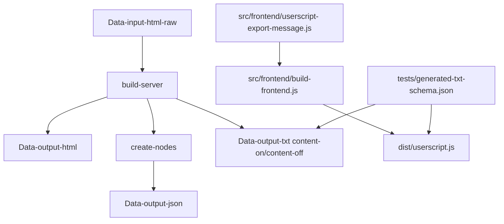

# Project Documentation

This project exports Messenger chat history to a `.txt` file using a Tampermonkey user script.

## Build flow

## Prerequisites

### User prerequisites

- Chrome or Firefox with Tampermonkey installed.
- A Messenger conversation open at `https://www.facebook.com/messages/*`.
- The generated userscript file `dist/userscript.js` loaded into Tampermonkey after running `pnpm run build:frontend`.

### Developer prerequisites

- Node.js installed.
- `nvm` installed or otherwise use a compatible Node version.
- `pnpm` installed globally, or use Node's built-in Corepack (`corepack enable`).
- A terminal opened in the `support/` folder.
- VS Code or another editor for working with the source.

> When updating `pnpm`, keep the `packageManager` field and `engines.pnpm` in sync.

## Windows PowerShell note

If PowerShell blocks `pnpm.ps1` or `npm` script execution because scripts are not digitally signed, use one of these options:

- Run in Command Prompt: `cmd /c "pnpm install"` or `cmd /c "npm install"`
- Enable local script execution: `Set-ExecutionPolicy -Scope CurrentUser RemoteSigned -Force`
- Use Corepack instead of global pnpm: `corepack enable && pnpm install`
- If you still see execution policy errors, see Microsoft docs: `https:/go.microsoft.com/fwlink/?LinkID=135170`

## Folder structure

- `src/frontend/`: browser-facing assets, userscript source, and frontend build tooling.
- `src/server/`: build scripts such as `build-preview.js`.
- `src/shared/`: shared helper scripts and node rules.
- `Data-input-html-raw/`: static raw HTML snapshots.
- `Data-output-html/`: generated optimized HTML snapshots.
- `Data-output-json/`: generated JSON preview output.
- `Data-output-json/raw-input-metadata.json`: build metadata for raw input file stability.
- `dist/`: generated one-file userscript output.
- `docs/`: documentation, changelog, and project notes.
- `tests/`: automated tests, fixtures, and validation scripts.
- `tests/generated-json-schema.json`: formal contract for generated preview JSON exports.
- `docs/JSON-Schema.md`: human-readable summary of the generated preview JSON contract.
- `src/shared/metadata-generated/metadata.json`: metadata for generated JSON export files.
- `.skills/`: planning, requirements, and development material.
- `.github-next/`: placeholder workflow definitions for future GitHub Actions integration.

## User guide

- Open a Messenger conversation in the browser.
- Generate `dist/userscript.js` by running `pnpm run build:frontend`, then load it through Tampermonkey.
- Start at the bottom of the conversation, or keep the current view if the visible date is within the export range.
- Set `From` / `To` dates to narrow the export range.
- Toggle `Include calls`, `Anonymize as`, `Summary`, `Include content`, and `Length` as needed.
- Click `Scan Messages` and download the resulting `.txt` file.
- After scan completion, the ready notice is minimal and shows conversation name, date interval, and elapsed scan time.

## Developer guide

- Open the project in VS Code and use the terminal in `support/`.
- Run `nvm use` in the `support/` folder to ensure the correct Node version from `.nvmrc`.
- Run `pnpm install --frozen-lockfile` once after cloning the repo.
- Run `pnpm run build:server` to clear outputs, regenerate optimized HTML, build data preview JSON, and generate a text export in `Data-output-txt/`.
- Run `pnpm run build:frontend` to emit the built userscript into `dist/userscript.js`.
- The browser export now writes a stable download file name such as `fb-chats-export-<shortname>.txt`.
- Run `pnpm run validate:dist` to verify the generated userscript header and versioned dist bundle.
- Run `pnpm run lint` to verify JavaScript style and catch syntax issues early.
- Run `pnpm run audit` to check dependency security status.
- `build:server` now runs non-interactively by default and uses `ANONYMIZE_RAW=true` when set.
- Use `pnpm run build:ci` to run the full CI-aligned build, including linting, build, and validation.
- Use `pnpm run build:ci:frontend` to run only the frontend build in CI mode.
- Set `ANONYMIZE_RAW=true` to anonymize raw chat names during server builds.
- Use `BUILD_VERSION=<build-id>` with `pnpm run build:frontend` to generate a build-specific userscript version without updating `package.json`.
- Use `pnpm run release:check` to verify changelog, schema, and dist sync before tagging.
- Use `pnpm run release:tag` to validate and tag the current package version automatically.

> The full CI workflow skips docs-only changes (`docs/**`, `README.md`, `CHANGELOG.md`, `.skills/**`) so the build only runs when actual code or schema changes are present.
>
> Prefer GitHub/CI builds over local builds because CI builds run in a clean, consistent environment, catch dependency and environment drift early, and ensure the same generated artifacts are reproducible for release verification.
- Run `pnpm run build-preview` to generate data preview JSON directly from optimized HTML.
- Run `pnpm run build:clean` to clear generated build artifacts while preserving raw inputs.
- Run `pnpm run create:nodes` for lower-level preview export debugging or custom workflows.
- Run `pnpm run validate:generated-json` to verify final `Data-output-json/` preview schema.
- Run `pnpm run test` to execute automated shared-code regression tests and generated JSON schema validation.
- Keep `dist/`, `Data-output-html/`, and `Data-output-json/` committed to source control.
- Keep `.skills/` for planning and requirements.

## Suggestions

- Add regression tests for shared message classification, content-type/length heuristics, and relative date parsing.
- Add browser DOM regression tests for userscript message parsing and TXT line formatting.
- Add golden snapshot validation for `content-on` and `content-off` TXT export outputs.
- Add a CI validation step that checks `dist/userscript.js` header, runtime TXT schema config, and release changelog sync.
- Use `BUILD_VERSION` in CI to emit deterministic `dist/userscript.js` `@version` values while leaving `package.json` unchanged.
- Add `pnpm run validate:dist` to verify the generated userscript bundle and its userscript header.
- Consider adding `pnpm run build:clean` or a small maintenance script to ensure expected data folder layout.
