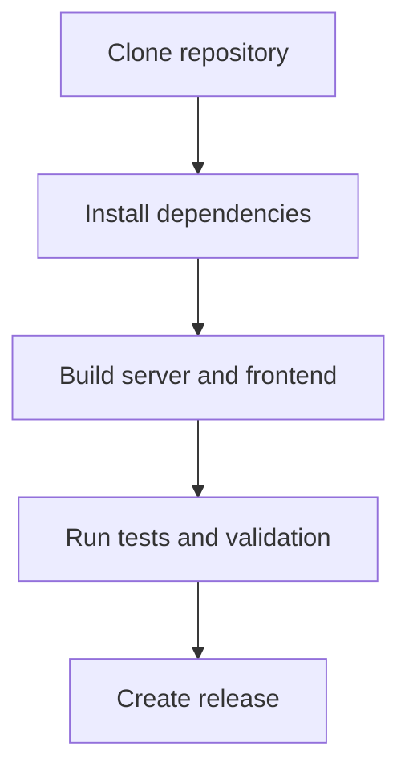

# Developer Guide

## Getting started

1. Open the `support/` folder in your editor.
2. Run `pnpm install --frozen-lockfile`.
3. Use `pnpm run build:frontend` to generate the browser bundle at `dist/app.js`.
4. Use `pnpm run build:server` to generate server-side output.

## Developer prerequisites

- Node.js 26 or newer.
- `pnpm` latest, or use Corepack with `corepack enable`.
- A terminal opened in the `support/` folder.

## Key build commands

- `pnpm run build` — run both server and frontend build pipelines.
- `pnpm run build:server` — build the server-side export pipeline.
- `pnpm run build:frontend` — build the browser export bundle.
- `pnpm run build:ci` — run the full CI workflow, including lint, audit, build, test, and validation.

## Testing and linting

- `pnpm run lint` — check JavaScript, docs, and TODO configuration.
- `pnpm run lint:todos` — verify `.TODO` files and `.todo/config.json` are consistent and up-to-date.
- `pnpm run lint:docs` — validate markdown in `docs/**/*.md`, `README.md`, and `CHANGELOG.md`.
- `pnpm run test` — run unit tests, integration tests, schema validation, and dist validation.

## Release workflow

See [Release Management](release-management.md) for the release process, tagging rules, and changelog expectations.

## Project docs

- [Project Overview](project-overview.md)
- [Folder Structure](folder-structure.md)
- [Tech Overview](tech.md)
- [JSON Schema](json-schema.md)
- [Message Types and Data Rules](message-types.md)
- [Todo Management](todo-management.md)
- [Release Management](release-management.md)
- [User Guide](../user-guide/README.md)
