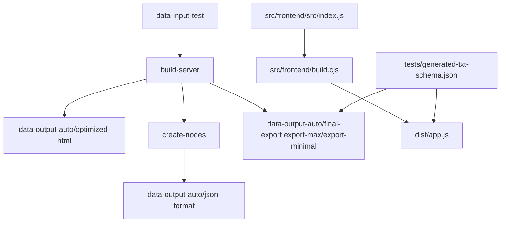

# Documentation Reference

This document contains the detailed documentation landing content used across the project's user-facing documentation.

## Project documentation overview

This project exports Messenger chat history to a `.txt` file using a Tampermonkey user script.

## Build flow

## Prerequisites

### User prerequisites

- Chrome or Firefox with Tampermonkey installed.
- A Messenger conversation open in the browser.
- The generated bundle file `dist/app.js` can be loaded into the browser after running `pnpm run build:frontend`.

### Developer prerequisites

- Node.js installed.
- `nvm` installed or otherwise use a compatible Node version.
- `pnpm` installed globally, or use Node's built-in Corepack (`corepack enable`).
- A terminal opened in the `support/` folder.
- VS Code or another editor for working with the source.

> When updating `pnpm`, keep the `packageManager` field and `engines.pnpm` in sync.

## Windows PowerShell note

If PowerShell blocks `pnpm.ps1` or `npm` script execution because scripts are not digitally signed, use one of these options:

- Run in Command Prompt: `cmd /c "pnpm install"` or `cmd /c "npm install"`
- Enable local script execution: `Set-ExecutionPolicy -Scope CurrentUser RemoteSigned -Force`
- Use Corepack instead of global pnpm: `corepack enable && pnpm install`
- If you still see execution policy errors, see Microsoft docs: `https://go.microsoft.com/fwlink/?LinkID=135170`

## Folder structure

- `src/frontend/`: browser-facing assets, frontend source, and frontend build tooling.
  - `src/frontend/src/`: browser-facing source entrypoint.
  - `src/frontend/build.cjs`: frontend build script using esbuild.
- `src/platforms/`: platform header and build helper files used by the frontend bundle build.
- `src/server/`: build scripts such as `build-preview.js`.
- `src/shared/`: shared helper scripts and node rules.
- `data-input-test/`: static raw HTML snapshots.
- `data-output-auto/optimized-html/`: generated optimized HTML snapshots.
- `data-output-auto/json-format/`: generated JSON preview output.
- `data-output-auto/json-format/raw-input-metadata.json`: build metadata for raw input file stability.
- `data-output-auto/final-export/`: generated export files such as `export-max.txt` and `export-minimal.txt`.
- `dist/`: generated one-file bundle output.
- `docs/`: documentation and project notes.
- `docs/developer-guide/folder-structure.md`: file and folder reference guide.
- `docs/developer-guide/tech.md`: technology and dependency overview.
- `docs/site.md`: documentation landing page with quick start and architecture overview.
- `docs/user-guide/terms-and-conditions.md`
- `docs/AI-interaction/`: AI interaction reference docs for user prompts and assistant behavior (hot prompt files live in `project-prompts/`).
- `CHANGELOG.md`: release history and version notes.
- `tests/`: automated tests, fixtures, and validation scripts.
- `tests/generated-json-schema.json`: formal contract for generated preview JSON exports.
- `docs/developer-guide/json-schema.md`: human-readable summary of the generated preview JSON contract.
- `src/shared/metadata-generated/metadata.json`: metadata for generated JSON export files.
- `.TODO/`: archived TODO notes and task tracking.
- `.skills/`: planning, requirements, and development material.
- `.github-next/`: placeholder workflow definitions for future GitHub Actions integration.

## User guide excerpt

- Open a Messenger conversation in the browser.
- Generate `dist/app.js` by running `pnpm run build:frontend`, then load it in the browser.
- Start at the bottom of the conversation, or keep the current view if the visible date is within the export range.

## Docs landing page details

### Quick start

1. Clone the repository and open the `support/` folder.
2. Run `pnpm install --frozen-lockfile`.
3. Run `pnpm run build:ci` to verify the full pipeline.
4. Run `pnpm run build:frontend` to generate `dist/app.js`.

> Optional: use `BUILD_PLATFORM=userscript pnpm run build:frontend` to emit a bundle with a Tampermonkey-compatible userscript header. The userscript header template is stored in `data-config/userscript/header.txt`.

### Architecture overview

- `src/` contains the application source and build scripts.
- `src/frontend/src/` contains the browser-facing source code.
- `src/frontend/build.cjs` contains the frontend build script using esbuild.
- `src/platforms/` contains platform header templates and frontend build helpers.
- `src/server/` contains server-side build scripts and preview generation.
- `src/shared/` contains shared helpers used by both server and frontend code.
- `data-input-test/` contains raw input snapshots and alias metadata used for debugging and regression.
- `data-output-auto/` contains generated output artifacts used for debugging and regression.
- `dist/` contains the bundled frontend app result.

### Docs and contribution

- `README.md` is the repository landing page.
- `docs/user-guide/README.md` contains end-user usage instructions and export format details.
- `docs/developer-guide/README.md` contains build, test, and release guidance.
- `docs/developer-guide/project-overview.md` contains the overall project architecture and workflow.
- `docs/developer-guide/release-management.md` contains release workflow and changelog rules.
- `docs/developer-guide/todo-management.md` contains the repository TODO process and numbering rules.
- `docs/AI-interaction/` contains AI interaction reference docs (hot prompt files live in `project-prompts/`, logs in `project-logs/`).
- `CONTRIBUTING.md` explains how to contribute.
- `CHANGELOG.md` contains release history and notes.
- `CODE_OF_CONDUCT.md` describes expected community behavior.
- `SECURITY.md` provides guidance for responsible security disclosure.
- Use the GitHub issue and PR templates in `.github/` for consistent contributions.

### Terms and usage

See `docs/user-guide/terms-and-conditions.md`.
