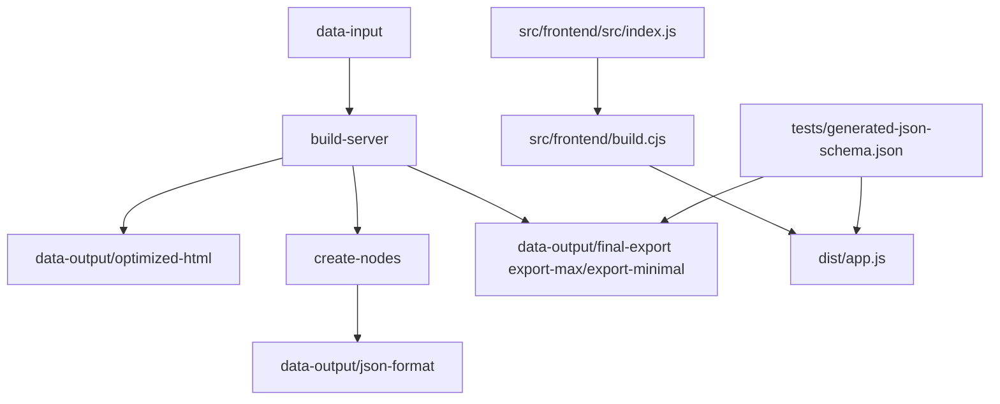

# Folder structure

This page describes the repository layout and the raw/generate data folder structure.

## Build flow

## Top-level files

- `package.json` / `pnpm-lock.yaml` — dependency and script management.
- `.editorconfig` — editor formatting rules.
- `.gitattributes` — repository line-ending and text normalization rules.
- `CHANGELOG.md` — release history and change notes.
- `README.md` — repository landing page.
- `CONTRIBUTING.md` — contribution guidelines.
- `.github/` — CI, issue, and PR templates.
- `.TODO/` — active, completed, and ignored work items.
- `.skills/` — planning, requirements, and background notes.

## Main folders

- `data-input/` — raw HTML snapshots and alias metadata used as source input.
- `data-output/optimized-html/` — generated optimized HTML snapshots.
- `data-output/json-format/` — generated preview JSON exports.
- `data-output/final-export/` — generated chat export text files.
- `dist/` — frontend bundle output.
- `src/` — application source and build scripts.
  - `src/frontend/` — browser-facing frontend code and build tooling.
  - `src/platforms/` — platform-specific header templates and bundle helpers.
  - `src/server/` — server-side build scripts.
  - `src/shared/` — shared helper libraries used by both server and frontend.
- `tests/` — automated tests, validation scripts, fixtures, and integration helpers.
- `docs/` — documentation pages and supporting documents.

## Documentation files

- `../site.md` — architecture overview and quick start.
- `folder-structure.md` — this file.
- `tech.md` — build, developer, and export format reference.
- `json-schema.md` — JSON preview export contract.
- `../user-guide/terms-and-conditions.md` — usage, privacy, and policy guidance.
