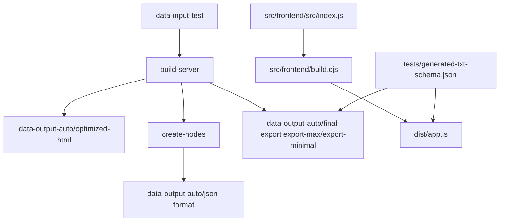

# Project Documentation

This project exports Messenger chat history to a `.txt` file using a Tampermonkey user script.

## Build flow



## Prerequisites

### User prerequisites

- Chrome or Firefox with Tampermonkey installed.
- A Messenger conversation open in the browser.
- The generated bundle file `dist/app.js` can be loaded into the browser after running `pnpm run build:frontend`.

### Developer prerequisites

- Node.js installed.
- `nvm` installed or otherwise use a compatible Node version.
- `pnpm` installed globally, or use Node's built-in Corepack (`corepack enable`).
- A terminal opened in the `support/` folder.
- VS Code or another editor for working with the source.

> When updating `pnpm`, keep the `packageManager` field and `engines.pnpm` in sync.

## Windows PowerShell note

If PowerShell blocks `pnpm.ps1` or `npm` script execution because scripts are not digitally signed, use one of these options:

- Run in Command Prompt: `cmd /c "pnpm install"` or `cmd /c "npm install"`
- Enable local script execution: `Set-ExecutionPolicy -Scope CurrentUser RemoteSigned -Force`
- Use Corepack instead of global pnpm: `corepack enable && pnpm install`
- If you still see execution policy errors, see Microsoft docs: `https://go.microsoft.com/fwlink/?LinkID=135170`

## Folder structure

- `src/frontend/`: browser-facing assets, frontend source, and frontend build tooling.
  - `src/frontend/src/`: browser-facing source entrypoint.
  - `src/frontend/build.cjs`: frontend build script using esbuild.
- `src/platforms/`: platform header and build helper files used by the frontend bundle build.
- `src/server/`: build scripts such as `build-preview.js`.
- `data-config/frontend_shared.json`: shared runtime alias mapping and relative date rules used by the browser export and server build.
- `data-config/server.json`: server-only build settings such as `overwriteToday` for deterministic text export timestamps.
- `src/shared/`: shared helper scripts and node rules.
- `data-input-test/`: static raw HTML snapshots.
- `data-output-auto/optimized-html/`: generated optimized HTML snapshots.
- `data-output-auto/json-format/`: generated JSON preview output.
- `data-output-auto/json-format/raw-input-metadata.json`: build metadata for raw input file stability.
- `data-output-auto/final-export/`: generated export files such as `export-max.txt` and `export-minimal.txt`.
- `dist/`: generated one-file bundle output.
- `docs/`: documentation and project notes.
- `folder-structure.md`: file and folder reference guide.
- `tech.md`: technology and dependency overview.
- `../site.md`: documentation landing page with quick start and architecture overview.
- `../user-guide/terms-and-conditions.md`
- `CHANGELOG.md`: release history and version notes.
- `tests/`: automated tests, fixtures, and validation scripts.
- `tests/generated-json-schema.json`: formal contract for generated preview JSON exports.
- `json-schema.md`: human-readable summary of the generated preview JSON contract.
- `src/shared/metadata-generated/metadata.json`: metadata for generated JSON export files.
- `.TODO/`: archived TODO notes and task tracking.
- `.skills/`: planning, requirements, and development material.
- `.github-next/`: placeholder workflow definitions for future GitHub Actions integration.

## User guide

- Open a Messenger conversation in the browser.
- Generate `dist/app.js` by running `pnpm run build:frontend`, then load it in the browser.
- Start at the bottom of the conversation, or keep the current view if the visible date is within the export range.
- Set `From` / `To` dates to narrow the export range.
- Toggle `Include calls`, `Alias`, `Raw link`, `Summary`, `Include content`, and `Length` as needed.
- Click `Scan Messages` and download the resulting `.txt` file.
- After scan completion, the ready notice is minimal and shows conversation name, date interval, and elapsed scan time.

## Export format

The exported `.txt` file contains three sections separated by `---`:

**Header** — method, message types, option state, and alias map:

```
Method: browser
Message types:
- image
- text
Options:
  content : true
  rawLink : false
Aliases:
  You : Youghurt
  any : Alpha
---
```

**Summary block** (included when the Summary toggle is on) — total and per-participant counts:

```
Total Summary
42 messages / 5 days
~ 30 text;
~ 320 words
~ 8 images
~ 4 calls 01:05:00

Alice Summary
25 messages / 5 days
~ 18 text;
~ 190 words
~ 5 images
~ 2 calls 00:45:00

Bob Summary
17 messages / 4 days
~ 12 text;
~ 130 words
~ 3 images
~ 2 calls 00:20:00

---
```

**Message lines** — one line per message:

```
[YYYY-MM-DD HH:MM] Sender: type length chars / content text
[YYYY-MM-DD HH:MM] Sender: image
[YYYY-MM-DD HH:MM] Sender: voice-note 00:20:00
[YYYY-MM-DD HH:MM] Sender: missed-audio-call
```

- `length chars` is omitted for images, calls, and voice messages.
- `/ content text` is included when the `Include content` toggle is on.
- Call lines include duration (e.g. `00:18:00`) when available.
- The server build labels counts as `posts`; the browser export labels them as `messages`.

## Developer guide

- Open the project in VS Code and use the terminal in `support/`.
- Run `nvm use` in the `support/` folder to ensure the correct Node version from `.nvmrc`.
- Run `pnpm install --frozen-lockfile` once after cloning the repo.
- Run `pnpm run build:server` to clear outputs, regenerate optimized HTML, build data preview JSON, and generate a text export in `data-output-auto/final-export/`.
- Run `pnpm run build:frontend` to emit the built bundle into `dist/app.js`.
- Use `BUILD_PLATFORM=userscript pnpm run build:frontend` to emit a userscript-compatible bundle header. The userscript header template is stored in `data-config/userscript/header.txt`.
- The browser export now writes a stable download file name such as `export-<shortname>.txt`.
- Run `pnpm run validate:dist` to verify the generated bundle header and versioned dist artifact.
- Run `pnpm run lint` to verify JavaScript style and catch syntax issues early.
- Run `pnpm run audit` to check dependency security status.
- `build:server` now runs non-interactively by default and uses `BUILD_RAW=true` when set.
- Use `pnpm run build:ci` to run the full CI-aligned build, including linting, build, and validation.
- Use `pnpm run build:ci:frontend` to run only the frontend build in CI mode.
- Set `BUILD_RAW=true` to write aliased raw HTML files during server builds.
- Use `BUILD_VERSION=<build-id>` with `pnpm run build:frontend` to generate a build-specific bundle version without updating `package.json`.
- Use `pnpm run release:check` to verify changelog, schema, and dist sync before tagging.
- Use `pnpm run release:tag` to validate and tag the current package version automatically.
- Use `pnpm run lint:docs` to validate markdown quality for docs-only changes.
- Use `pnpm run link:docs` to validate external links in docs and catch broken references before publishing.
- A GitHub release workflow is configured to publish release notes from root `CHANGELOG.md` on `v*` tags.

> The full CI workflow skips docs-only changes (`docs/**`, `README.md`, `CHANGELOG.md`, `.skills/**`) so the build only runs when actual code or schema changes are present.
>
> Prefer GitHub/CI builds over local builds because CI builds run in a clean, consistent environment, catch dependency and environment drift early, and ensure the same generated artifacts are reproducible for release verification.

- Run `pnpm run build-preview` to generate data preview JSON directly from optimized HTML.
- Run `pnpm run build:clean` to clear generated build artifacts while preserving raw inputs.
- Run `pnpm run create:nodes` for lower-level preview export debugging or custom workflows.
- Run `pnpm run validate:generated-json` to verify final `data-output-auto/json-format/` preview schema.
- Run `pnpm run test` to execute automated shared-code regression tests and generated JSON schema validation.
- Keep `dist/`, `data-output-auto/optimized-html/`, and `data-output-auto/json-format/` committed to source control.
- Keep `.skills/` for planning and requirements.

## How to contribute

- Follow `CONTRIBUTING.md` for contribution guidelines.
- Use the GitHub issue and PR templates in `.github/` for new reports and feature requests.
- Keep the project focused on personal summary use and avoid publishing private chat content.
- Use `pnpm run lint:docs`, `pnpm run link:docs`, and `pnpm run format:check` before submitting docs or formatting changes.

