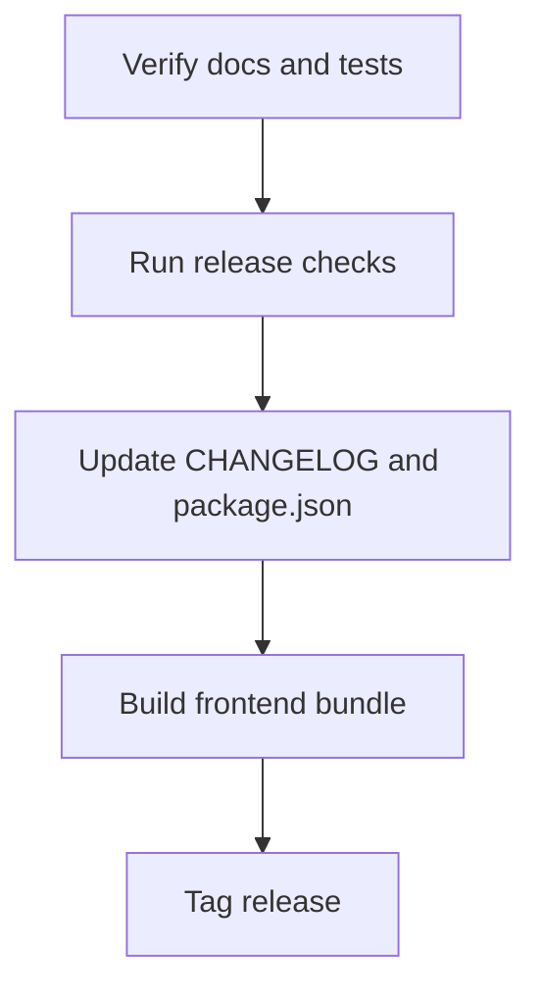

# Release Management

## Release verification

Before tagging a release, verify the repository and generated artifacts.

- Run `pnpm lint:package` to verify `package.json` is consistent.
- Run `pnpm build:verify` and `pnpm lint:unreleased` to confirm dist and `CHANGELOG.md` are valid.
- Run `pnpm test:js` to confirm the remaining JS test suite passes.

If validation fails, fix the reported issue before tagging.

## Tagging a release

The release tag is created from `package.json`.

- `pnpm run release:tag` runs the release check and then tags the current commit as `v<version>`.
- The package version is defined in `package.json`.

## Changelog rules

- Write only active changes in `CHANGELOG.md`.
- Use sections such as `### Added`, `### Changed`, `### Fixed`, and `### Dev`.
- Keep entries short and user-facing.
- Add new entries to the `## [Unreleased]` section only.
- Do not modify already released version sections.

## Commit conventions

- Use Conventional Commits.
- Valid commit types include `feat`, `fix`, `chore`, `docs`, `test`, `refactor`, `perf`, `ci`, and `revert`.
- The subject should be lowercase and without a trailing period.
- For breaking changes use `!` after the type, e.g. `feat!: ...`.

## Documentation and release notes

- Use `pnpm run lint:docs` to validate markdown before publishing.
- Use `pnpm run link:docs` to verify references and external links.
- Keep release notes in `CHANGELOG.md` and follow the repository changelog rules.
