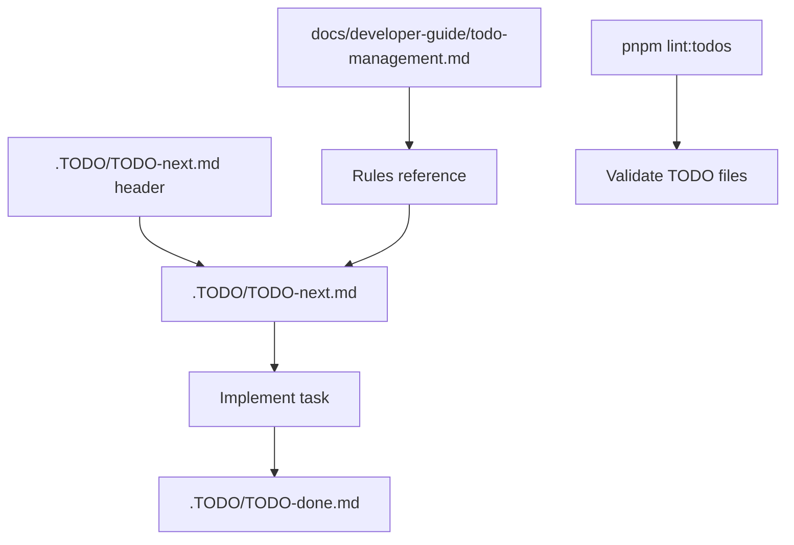

# TODO Management

This repository uses a small structured TODO system for developer work tracking.

## Files

- `.TODO/TODO-next.md` — active work items that should be done next.
- `.TODO/TODO-done.md` — append-only log for tasks completed from `TODO-next.md`.
- `.TODO/TODO-future.md` — backlog items that need new samples, significant new scope, or can wait.
- `.TODO/TODO-ignore.md` — intentionally deferred or rejected items with rationale.
- `.TODO/TODO-audit.md` — ongoing hygiene checks run before releases or when guidance changes.
- `docs/developer-guide/todo-management.md` — canonical rules reference for numbering, lifecycle, and style.

## How to add a new task

1. Read the header of `.TODO/TODO-next.md` for the current prefix, next available number, and declared gaps.
2. Use the smallest available gap number first; only advance the next available number when no gap remains.
3. Add the bullet in the correct category section of `.TODO/TODO-next.md`.
4. Run `pnpm lint:todos` to validate.

## Task numbering

- Task IDs use the prefix declared in `TODO-next.md` (`T-`).
- When adding new tasks, prefer the smallest available gap number from the existing sequence before using the current next available number.
- `TODO-next.md` must keep every canonical section, including empty sections, using "- no tasks" as the placeholder so gap reuse stays localized and visible.

## Task lifecycle

- New work starts in `.TODO/TODO-next.md`.
- When adding a new task, fill available gap numbers before advancing the next T-number.
- Optionally renumber remaining tasks to compact gaps when no agent is actively working on those numbers.
- When a task is implemented, move the line to `.TODO/TODO-done.md` unchanged.
- Keep `.TODO/TODO-future.md` for work that is worthwhile but not ready for the next queue.
- Keep `.TODO/TODO-audit.md` for repeatable hygiene and verification tasks that are always valid.
- Keep `.TODO/TODO-ignore.md` for work that is intentionally excluded, along with a short rationale.
- TODO files are user-facing — never embed temporary implementation comments or notes.

Keep one task in only one file. Moving a task from active to any retired
state removes it from the active queue and keeps the original `T-` number
unchanged.

## Adding a meaningful task

A useful task is specific enough that someone can start it without reading
other files. Avoid phrases like `remaining tasks`, `the queue`, or
`update docs`. Prefer an action with a clear result. Banal rote tasks
(version bumps, file syncs, routine updates) belong in this doc's guidance
or automation scripts, not as TODO items.

Each task must describe a user-visible or design-level outcome. Ask: "What
will the user observe or be able to do after this task is complete?"

Good:

- T126. Add editor style switcher for Default, Hero, Compact, and Inline
  variants.
- T145. Keep counter ticking smooth when the browser tab is backgrounded by
  syncing to visible-frame updates.

Bad:

- T126. Implement remaining todo tasks from the queue. (vague — does not
  specify what to build)
- T126. Update documentation. (rote — happens as part of implementation)
- T126. Sync version to 1.3.0. (rote — file sync, not user outcome)
- T126. Bump plugin version. (rote — routine maintenance)

A task should describe what changes, not that work exists. When in doubt,
ask whether the bullet tells the implementer what to build. If the task is
purely mechanical (version bump, file copy, config alignment), handle it
automatically in scripts or document it here instead.

## Commit references

Add the short commit hash after each done task entry when the commit is
known:

- T-NNN. Task description (abc1234)

Do not list multiple commit hashes for one task. If a task truly spans
commits, split it into separate tasks instead of stacking hashes.

## Log files

Project logs (`project-logs/interaction-log.md` and
`project-logs/activity-log.md`) should contain standalone summaries of user
requests and AI actions. Do not reference task numbers in log entries. Logs
are not a cross-reference index for tasks.

## Gap lifecycle and safe renumbering

Tasks can move from `TODO-next.md` to `TODO-future.md`, `TODO-ignore.md`, or `TODO-done.md`.
When they do, their T-number becomes a gap.
Leave gaps in place during active work so concurrent agents can coordinate by number.

Renumbering is allowed only when no agent is actively working on a numbered task.
A safe renumber is a purely mechanical compaction with no semantic change.
Do not renumber while another session claims a task number.

## Safe file-handling rules

`TODO-done.md`, `CHANGELOG.md`, and session logs are append-only history.
Treat them as immutable historical records.

- **Never rewrite** an append-only file in full. Always use the `edit` tool
  to add new entries without removing or changing existing content.
- When asked to "update" these files, always **append first, never delete**.
- Before editing, check the current and `HEAD` content to establish a
  baseline. After editing, verify with `git diff HEAD -- <file>` that only
  additions appear.
- If any existing entry is altered or removed, restore the file from `HEAD`
  immediately and re-apply only the intended additions.
