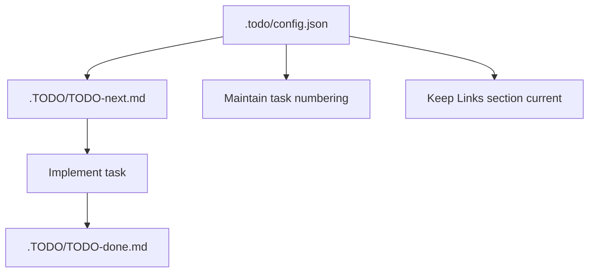
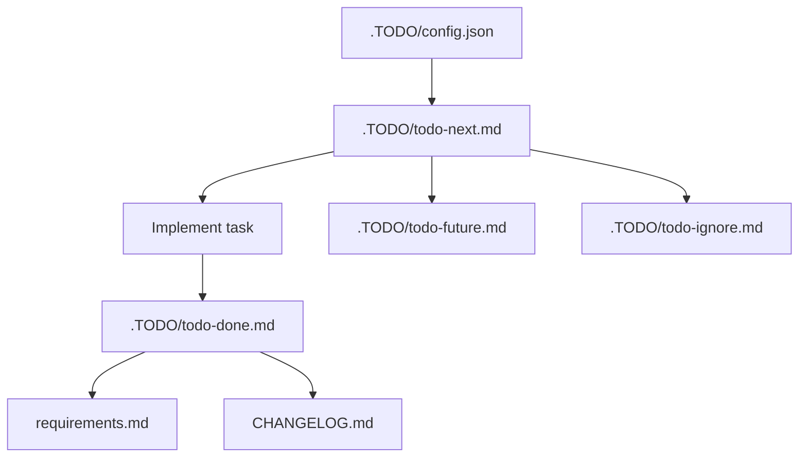

# TODO Management



This repository uses a small structured TODO system for developer work tracking.

## Files

- `.TODO/TODO-next.md` — active work items that should be done next.
- `.TODO/TODO-done.md` — completed items moved here after implementation.
- `.TODO/TODO-future.md` — backlog items that need new samples, significant new scope, or can wait.
- `.TODO/TODO-ignore.md` — intentionally deferred or rejected items with rationale.
- `.todo/config.json` — authoritative TODO metadata, including the next task number, file paths, and instructions.

> The `.todo/` directory may also contain other manual or repository-specific files. Keep those files as-is unless a change to TODO metadata is required.

## How to add a new task

1. Open `.todo/config.json` first.
2. Read `nextTaskNumber` and the `instructions` field.
3. Add one bullet per task in `.TODO/TODO-next.md`.
4. Use the `currentTaskPrefix` and `taskIdPattern` rules from `.todo/config.json`.
5. Update `nextTaskNumber` only when you add a new task.

> Use `pnpm run lint:todos` to verify that `.TODO` files and `.todo/config.json` are consistent.

Example:

- T126. Describe the new shared config behavior for frontend and server build logic.

## Task numbering

- Task IDs use the prefix defined in `.todo/config.json` (typically `T`).
- The number should be taken from `.todo/config.json` and should be strictly increasing.
- Do not reuse or renumber existing tasks unless correcting a clear error.

## Task lifecycle

- New work starts in `TODO-next.md`.
- When a task is implemented, move the line to `TODO-done.md` unchanged.
- Keep `TODO-future.md` for work that is worthwhile but not ready for the next queue.
- Keep `TODO-ignore.md` for work that is intentionally excluded, along with a short rationale.

## Structure expectations

- Every `.TODO/*` file should include a `Links` section pointing to the other TODO files and `.todo/config.json`.
- Keep TODO entries concise and actionable.
- Preserve task numbers and descriptions when moving items between files.
- Write task bullets as direct present-action statements.
- Avoid changelog-style phrasing such as `now ...`, `now also ...`, `now removed ...`, `now always ...`, `now supports ...`, or `now documents ...`.
- Prefer statements like `export filenames changed to export-max.txt ...` or `show platform reference only in terms and userscript header metadata.`

## Task wording

Task bullets should describe the intended action or result, not explain what changed. Use the present tense and avoid retrospective language.

Example:

- T126. Describe the new shared config behavior for frontend and server build logic.

Instead of:

- T126. Now the shared config behavior is described for frontend and server build logic.

## Why this exists

This doc helps keep the repository TODO process consistent and avoid low or duplicated task numbers.
It also ensures AI-assisted updates use the same task numbering source as human contributors.


[additional]
# TODO Management

This repository tracks work in `.TODO/`. `.TODO/config.json` owns task numbering, tracked TODO file
paths, and validation metadata.

## Flow



## Two States

TODO files have two repository states:

- Active state: `.TODO/todo-next.md` is the only active queue for confirmed implementation work.
- Retired states: `.TODO/todo-done.md`, `.TODO/todo-future.md`, and `.TODO/todo-ignore.md` store
  completed, deferred, or deliberate no-fix decisions.

Keep one task in only one state. Moving a task from active to any retired state removes it from the
active queue and keeps the original `T-` number unchanged.

## Files

| File                   | Purpose                                                     |
| ---------------------- | ----------------------------------------------------------- |
| `.TODO/config.json`    | Task numbering, tracked TODO file paths, and agent rules.   |
| `.TODO/todo-next.md`   | The only active queue for confirmed work.                   |
| `.TODO/todo-done.md`   | Completed work history.                                     |
| `.TODO/todo-future.md` | Valid work that should wait.                                |
| `.TODO/todo-ignore.md` | Intentionally excluded work with rationale.                 |

Dist and audit-specific TODO files are retired. Dist follow-ups, audit findings, and migration
records live in the regular TODO files and project guides.

## Task Numbering

Use `.TODO/config.json` before adding tasks:

1. Read `nextTaskNumber`.
2. Add one task per bullet using the `T-` prefix, for example `T-244`.
3. Increase `nextTaskNumber` only when adding a new numbered task.
4. Do not reuse or renumber existing task IDs unless correcting a clear error.
5. Every task in the TODO files must have a `T-` number.
6. Write task descriptions as direct present-action statements, not retrospective changelog copy.

## How To Add Work

Add confirmed work to `.TODO/todo-next.md`. Use `.TODO/todo-future.md` for deferred work and
`.TODO/todo-ignore.md` for deliberate no-fix decisions.

Each TODO file starts with a short description and links to the other TODO files. Keep that header in
place when editing.

## Completion Rules

Move completed work from `.TODO/todo-next.md` to `.TODO/todo-done.md`. User-observable completed
work also updates `requirements.md`; release-facing changes update `CHANGELOG.md` under
`## [Unreleased]`.

Developer-only changes belong in the changelog `### Dev` section.

## Migration Record

The retired TODO files were:

- `.TODO/todo.md`
- `.TODO/todo-audit.md`
- `.TODO/todo-next-audit.md`
- `.TODO/todo-dist.md`
- `.TODO/todo-dist-done.md`
- `.TODO/todo-dist-future.md`
- `.TODO/todo-dist-no-fix.md`

Most old audit tasks moved into:

- `.TODO/todo-done.md` for completed documentation, static asset, dependency, flowchart, and setup
  work.
- `.TODO/todo-next.md` for active audit work covering API docs, security, production stability, code
  quality, performance, monitoring, billing, dependency drift, and test coverage.
- `docs/Developer_Guides/PROJECT_AUDIT_GUIDE.md` for repeatable auditor workflow.
- `docs/Developer_Guides/PROJECT_TESTING_GUIDE.md` for repeatable start-to-finish product testing.

The dist deployment succeeded, so completed deployment confirmations moved to `.TODO/todo-done.md`.
Remaining dist ideas moved to `.TODO/todo-future.md`, and deliberate no-fix decisions moved to
`.TODO/todo-ignore.md`.

## Retirement And Temporary TODOs

Temporary TODO branches are allowed only while a focused migration or audit is actively being
processed. They must be short-lived and folded back into the four regular TODO files before the work
is considered complete.

Examples:

- A temporary deployment audit may start as `.TODO/todo-dist-temp.md`, then move completed items to
  `.TODO/todo-done.md`, deferred work to `.TODO/todo-future.md`, and no-fix decisions to
  `.TODO/todo-ignore.md`.
- A temporary security audit may start as `.TODO/todo-security-temp.md`, then move actionable work to
  `.TODO/todo-next.md` with `T-` numbers and convert repeatable process steps into a developer guide.

Retired TODO branches should not remain in `.TODO/config.json`. Keep the regular queues as the only
validated TODO files.

## Validation

```bash
pnpm lint:todos
```

The TODO checker validates `.TODO/config.json`, confirms configured files exist, checks task ID
format, prevents duplicate task IDs across configured TODO files, and reports active versus retired
task counts.