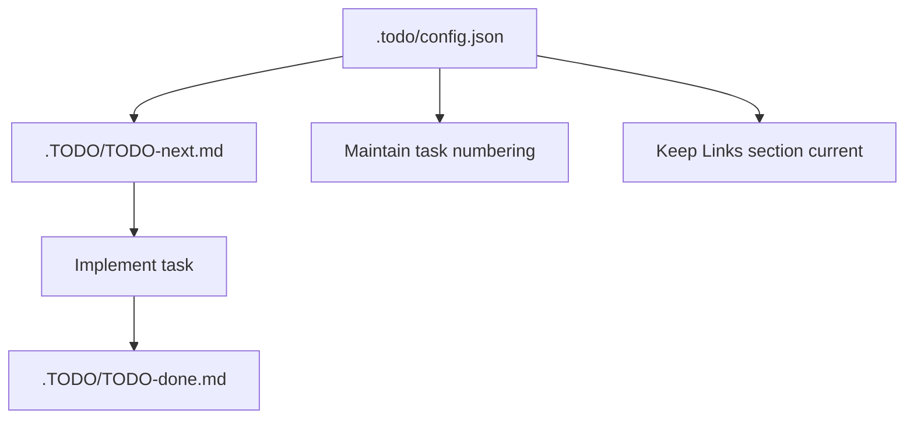

# TODO Management

This repository uses a small structured TODO system for developer work tracking.

## Files

- `.TODO/TODO-next.md` — active work items that should be done next.
- `.TODO/TODO-done.md` — completed items moved here after implementation.
- `.TODO/TODO-future.md` — backlog items that need new samples, significant new scope, or can wait.
- `.TODO/TODO-ignore.md` — intentionally deferred or rejected items with rationale.
- `.todo/config.json` — authoritative TODO metadata, including the next task number, file paths, and instructions.

> The `.todo/` directory may also contain other manual or repository-specific files. Keep those files as-is unless a change to TODO metadata is required.

## How to add a new task

1. Open `.todo/config.json` first.
2. Read `nextTaskNumber` and the `instructions` field.
3. Add one bullet per task in `.TODO/TODO-next.md`.
4. Use the `currentTaskPrefix` and `taskIdPattern` rules from `.todo/config.json`.
5. Update `nextTaskNumber` only when you add a new task.

> Use `pnpm run lint:todos` to verify that `.TODO` files and `.todo/config.json` are consistent.

Example:

- T126. Describe the new shared config behavior for frontend and server build logic.

## Task numbering

- Task IDs use the prefix defined in `.todo/config.json` (typically `T`).
- The number should be taken from `.todo/config.json` and should be strictly increasing.
- Do not reuse or renumber existing tasks unless correcting a clear error.

## Task lifecycle

- New work starts in `TODO-next.md`.
- When a task is implemented, move the line to `TODO-done.md` unchanged.
- Keep `TODO-future.md` for work that is worthwhile but not ready for the next queue.
- Keep `TODO-ignore.md` for work that is intentionally excluded, along with a short rationale.

## Structure expectations

- Every `.TODO/*` file should include a `Links` section pointing to the other TODO files and `.todo/config.json`.
- Keep TODO entries concise and actionable.
- Preserve task numbers and descriptions when moving items between files.
- Write task bullets as direct present-action statements.
- Avoid changelog-style phrasing such as `now ...`, `now also ...`, `now removed ...`, `now always ...`, `now supports ...`, or `now documents ...`.
- Prefer statements like `export filenames changed to export-max.txt ...` or `show platform reference only in terms and userscript header metadata.`

## Task wording

Task bullets should describe the intended action or result, not explain what changed. Use the present tense and avoid retrospective language.

Example:

- T126. Describe the new shared config behavior for frontend and server build logic.

Instead of:

- T126. Now the shared config behavior is described for frontend and server build logic.

## Why this exists

This doc helps keep the repository TODO process consistent and avoid low or duplicated task numbers.
It also ensures AI-assisted updates use the same task numbering source as human contributors.
