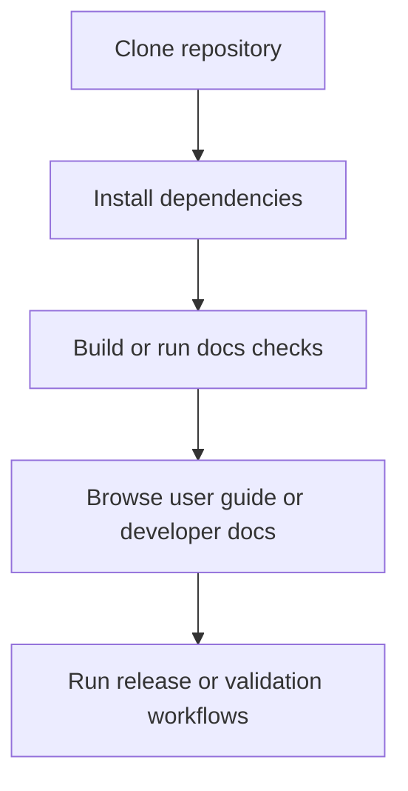

# Documentation Site

This page is a high-level docs landing page for quick onboarding and architecture overview.

## Quick start

1. Clone the repository and open the `support/` folder.
2. Run `pnpm install --frozen-lockfile`.
3. Run `pnpm run build:ci` to verify the full pipeline.
4. Run `pnpm run build:frontend` to generate `dist/app.js`.

> Optional: use `BUILD_PLATFORM=userscript pnpm run build:frontend` to emit a bundle with a Tampermonkey-compatible userscript header. The userscript header template is now stored in `data-config/userscript/header.txt`.

## Architecture overview

- `src/` contains the application source and build scripts.
- `src/frontend/src/` contains the browser-facing source code.
- `src/frontend/build.cjs` contains the frontend build wrapper that delegates to `src/frontend/builds.js`.
- `src/platforms/` contains platform header templates and frontend build helpers.
- `src/server/` contains server-side build scripts and preview generation.
- `src/shared/` contains shared helpers used by both server and frontend code.
- `data-input/` contains raw input snapshots and alias metadata used for debugging and regression.
- `data-output/` contains generated output artifacts used for debugging and regression.
- `dist/` contains the bundled frontend app result.

## Docs and contribution

- `README.md` is the repository landing page.
- `docs/user-guide/README.md` contains end-user usage instructions and export format details.
- `docs/developer-guide/README.md` contains build, test, and release guidance.
- `docs/developer-guide/project-overview.md` contains the overall project architecture and workflow.
- `docs/developer-guide/release-management.md` contains release workflow and changelog rules.
- `docs/developer-guide/todo-management.md` contains the repository TODO process and numbering rules.
- `CONTRIBUTING.md` explains how to contribute.
- `CHANGELOG.md` contains release history and notes.
- `CODE_OF_CONDUCT.md` describes expected community behavior.
- `SECURITY.md` provides guidance for responsible security disclosure.
- Use the GitHub issue and PR templates in `.github/` for consistent contributions.

## Terms and usage

See `docs/user-guide/terms-and-conditions.md`.
