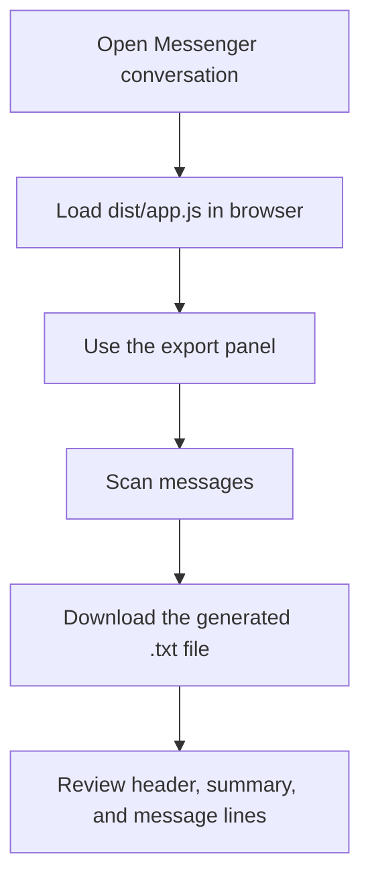

# User Guide



## What this does

This project lets you export a Messenger conversation to a `.txt` file in the browser. The browser export panel scans visible messages, applies alias replacements, and writes a stable export file.

## Before you start

- Chrome or Firefox with Tampermonkey installed.
- A Messenger conversation open in the browser.
- The built browser bundle file `dist/app.js` loaded into the page after running `pnpm run build:frontend`.

## Using the browser export panel

1. Open the conversation and scroll so the conversation content is visible.
2. Load `dist/app.js` into the browser or userscript extension.
3. Set the export date range using `From:` and `To:`.
4. Optionally enter a custom file name in the `File:` field.
5. Toggle options:
   - `Calls`
   - `Alias`
   - `Summary`
   - `Include content`
   - `Raw link`
   - `Length`
   - `Alias` applies runtime alias replacements and records the alias map in the file header. Explicit sender mappings and the `any` fallback alias are both captured.
   - `File:` preserves the custom file name in session storage and uses it for the generated download.
6. Click `Scan Messages`.
7. After scanning completes, download the resulting `.txt` file.

## Export format

The generated `.txt` file contains three sections separated by `---`:

### Header

```text
Method: browser
Message types:
- image
- text
Options:
  content : true
  rawLink : false
Aliases:
  You : Youghurt
  any : Alpha
---
```

### Summary block

When `Summary` is enabled, the file includes totals and per-person stats.  
The image count (`~ N images`) aggregates the per-message `imageCount` values — each message may contain multiple images, and profile avatars are excluded automatically.

```text
Total Summary
42 messages / 5 days
~ 30 text;
~ 320 words
~ 8 images
~ 4 calls 01:05:00

Alice Summary
25 messages / 5 days
~ 18 text;
~ 190 words
~ 5 images
~ 2 calls 00:45:00

Bob Summary
17 messages / 4 days
~ 12 text;
~ 130 words
~ 3 images
~ 2 calls 00:20:00

---
```

### Message lines

Each message is written as a single line:

```text
[YYYY-MM-DD HH:MM] Sender: type length chars / content text
[YYYY-MM-DD HH:MM] Sender: image
[YYYY-MM-DD HH:MM] Sender: voice-note 00:20:00
[YYYY-MM-DD HH:MM] Sender: missed-audio-call
```

- `length chars` is omitted for images, calls, and voice messages.
- Content text appears only when `Include content` is enabled.
- Calls include duration when available.

### Sender name validation

Sender names are validated during export to catch malformed or non-name labels:

- Maximum **3 words** — names with 4 or more parts are discarded.
- **Under 50 characters** — names 50 characters or longer are discarded.
- **No digits** — names containing `0-9` are discarded.
- **Letters only** (including accented Latin) — dots, apostrophes, and hyphens are allowed.
- If a sender name fails validation, the export falls back to the raw label text instead.

## Terms and conditions

See [Terms and Conditions](terms-and-conditions.md) for acceptable use, privacy guidance, and data handling recommendations.
